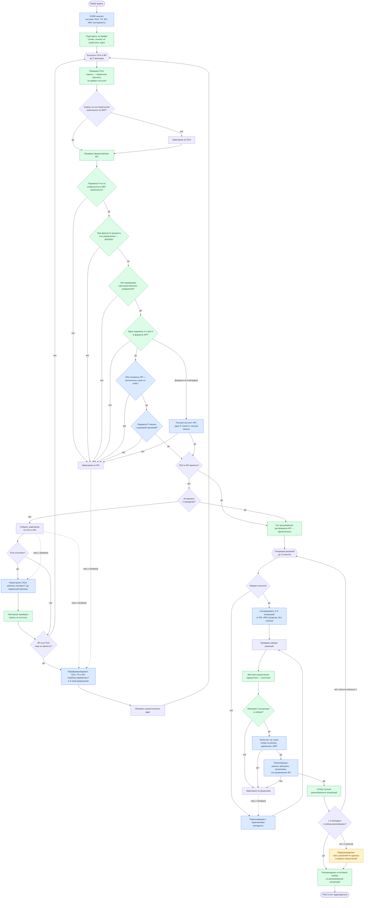

# Оркестрация TRIZ-пайплайна

Блок-схемы отражают **фактический поток** системы, но подписаны **языком ТРИЗ** — для методиста и аналитика, без имён функций и модулей.

---

## Легенда

| Цвет | Что означает |
|------|--------------|
| 🔵 **Голубой** | Думает аналитик (ИИ): формулирует вопросы, строит ПСА/противоречия/решения, оценивает смысл |
| 🟢 **Зелёный** | Жёсткий методический контроль: правила ТРИЗ в коде, без «творческой интерпретации» |
| 🟠 **Оранжевый** | Обратная связь: замечания методиста передаются аналитику для переделки |
| **Пунктир** `-.->` | Повторный проход с учётом замечаний (retry) |

**Где аналитик (ИИ):** вопросы интервью, извлечение фактов из текста, CORE-анализ, переформулировка ПСА/ТП/ФП, генерация концепций, семантическая оценка желательности половин ФП, релевантности параметра, тупиков, ресурсов, разнообразия.

**Где методический контроль (код):** очистка ответов, счётчик попыток, пропуск пункта, шаблон формулы ФП, запрет пространственной маскировки, проверка оси разрешения (фазность → время), запрет параметров отвергнутого компонента, согласование типа противоречия, отбор разнообразного набора решений, сборка рекомендаций.

**Циклы повторения:**
- **Интервью:** до 2 попыток на пункт → уточняющий переспрос; после 2 неудач → «данные не получены» (пропуск)
- **ПСА и ФП:** до 3 проходов; при отклонении → сначала перестройка ПСА, затем переформулировка ТП и ФП
- **Решения:** до 3 генераций; после каждой — накопление валидных концепций и отбор по разнообразию

---

## Схема 1 — Сбор исходных данных (интервью)

Задачедатель отвечает **по одному пункту за раз**. Аналитик не переходит к анализу, пока не закрыты блоки 1–5.

### Шесть блоков интервью

| Блок | Что фиксируем |
|------|----------------|
| **1 — НЭ** | Само явление, где, когда, последствия, гипотеза причины от задачедателя |
| **2 — Система** | Главная функция, элементы, объект обработки, надсистема |
| **3 — Результаты** | Технический результат (в числах), экономический эффект |
| **4 — Ограничения и ресурсы** | Что нельзя менять; что доступно |
| **5 — Известные решения** | Попытки, почему не сработало, нереализованные идеи |
| **6 — Эксперты** | Кто владеет знанием о проблеме |

Блоки **1–5** обязательны для перехода к резюме. Блок **6** опрашивается, но не блокирует резюме.

```mermaid
flowchart TD
    START([Задачедатель отвечает на вопрос]) --> LOAD[Восстановить состояние интервью]
    LOAD --> FIX[Зафиксировать ответ на текущий пункт]

    FIX --> CLEAN[Очистить ответ<br/>убрать копипаст вопроса и служебный мусор]
    CLEAN --> WAIT{Ждём ответ<br/>на текущий пункт?}
    WAIT -->|нет| AUTO
    WAIT -->|да| EMPTY{Ответ пустой?}

    EMPTY -->|да| TRY1[+1 неудачная попытка]
    TRY1 --> AUTO

    EMPTY -->|нет| TAUT{«Когда НЭ» —<br/>тавтология без фактов?}
    TAUT -->|да| TRY2[+1 неудачная попытка]
    TRY2 --> AUTO

    TAUT -->|нет| OK[Пункт подтверждён задачедателем]
    OK --> AUTO

    AUTO[Аналитик извлекает факты<br/>из свободного текста ответа]:::llm
    AUTO --> PART[Автоподтверждение очевидных фактов:<br/>НЭ, где, последствия, экономика]
    PART --> NEXT[Выбрать следующий незакрытый пункт<br/>в текущем блоке]

    NEXT --> GIVEUP{2 неудачные попытки<br/>на этот пункт?}
    GIVEUP -->|да| SKIP[Пропуск: «данные не получены»]:::validator
    SKIP --> NEXT
    GIVEUP -->|нет| ASK[Сформировать контекст<br/>и задать ОДИН вопрос]:::llm
    ASK --> REPLY([Вопрос аналитика задачедателю])

    REPLY --> START

    ASK --> READY{Блоки 1–5 закрыты?}
    READY -->|нет, была неудача| HINT[Уточняющий переспрос<br/>по тому же пункту]:::feedback
    HINT --> ASK
    READY -->|да| RESUME[Резюме собранного<br/>+ запрос подтверждения]:::llm

    RESUME --> GO([Запуск TRIZ-анализа])
    GO --> BRIEF[Сборка брифа задачи]:::validator
    BRIEF --> FULL{Бриф не пуст?}
    FULL -->|нет| STOP([Анализ невозможен])
    FULL -->|да| ANALYZE[Пайплайн анализа]

    BRIEF --> DATA[Раздел: подтверждённые данные<br/>по порядку блоков]
    BRIEF --> GAPS[[ПРОБЕЛЫ В ДАННЫХ]<br/>пропущенные пункты<br/>→ допущения в анализе]:::feedback

    TRY1 -.->|попыток меньше 2| HINT
    TRY2 -.->|попыток меньше 2| HINT

    classDef llm fill:#dbeafe,stroke:#2563eb,color:#1e3a5f
    classDef validator fill:#dcfce7,stroke:#16a34a,color:#14532d
    classDef feedback fill:#fef3c7,stroke:#d97706,color:#78350f
```

---

## Схема 2 — Экспертный TRIZ-анализ

На входе — **бриф** (подтверждённые данные + пробелы + диалог). На выходе — **отчёт**: аналитическое ядро, концепции решений, рекомендации.

### Стадии и артефакты

| Стадия | Что получаем |
|--------|----------------|
| CORE-анализ | Системная модель, ПСА, корневая причина, ТП, ФП, ИКР, ресурсы, инструменты ТРИЗ |
| Контроль ПСА и ФП | Проверенные корневая причина и формулировка ФП |
| Генерация решений | 3–5 концепций с привязкой к ТРИЗ и ресурсам |
| Финал | Ранжирование, рекомендации к внедрению, итоговый вывод |



---

## Краткое описание потока (язык ТРИЗ)

### Интервью — один цикл «вопрос — ответ»

1. Зафиксировать ответ на текущий пункт (с очисткой от мусора).
2. Отклонить пустой ответ или тавтологию на вопрос «когда проявляется НЭ».
3. Параллельно извлечь из текста уже названные факты (без домысливания).
4. Выбрать следующий незакрытый пункт; после 2 неудач — пропуск с пометкой «данные не получены».
5. Аналитик задаёт **один** вопрос по контексту собранного.
6. Когда блоки 1–5 закрыты — резюме и подтверждение.
7. Сборка брифа: подтверждённые данные + **ПРОБЕЛЫ** (будут допущениями) + диалог справочно.

### Анализ — пайплайн от брифа к отчёту

| Этап | Содержание |
|------|------------|
| 1. CORE | Переформулировка задачи, системная модель, ПСА до физики/химии, корневая причина, ТП, ФП по формуле, ИКР, анализ ресурсов, инструменты ТРИЗ |
| 2. Контроль ПСА/ФП | Корень не на костыле; P не из отвергнутого компонента; при фазности — разделение во времени; один параметр; обе пользы желательны; P связан с корнем. При отказе — перестройка ПСА, затем ТП+ФП с перебором P и осей |
| 3. Решения | 3–5 концепций от ФП/ИКР/ресурсов; не повторять тупики; в рамках ограничений; разные принципы и оси. До 3 попыток с накоплением |
| 4. Отчёт | Ранжирование, рекомендации к внедрению, приоритетное решение, риски, следующий шаг |

### Входы генерации решений

- ТП, ФП, ИКР
- Ресурсы (из анализа и из брифа)
- Известные попытки, почему не сработало, нереализованные идеи
- Жёсткие ограничения
- Замечания методиста (при повторной генерации)

---

*Соответствие узлов схемы исходному коду: `chat_service.py`, `interview_state.py`, `chat_brief.py`, `chain.py`, `fp_validator.py`, `psa_validator.py`, `solution_validator.py`.*
